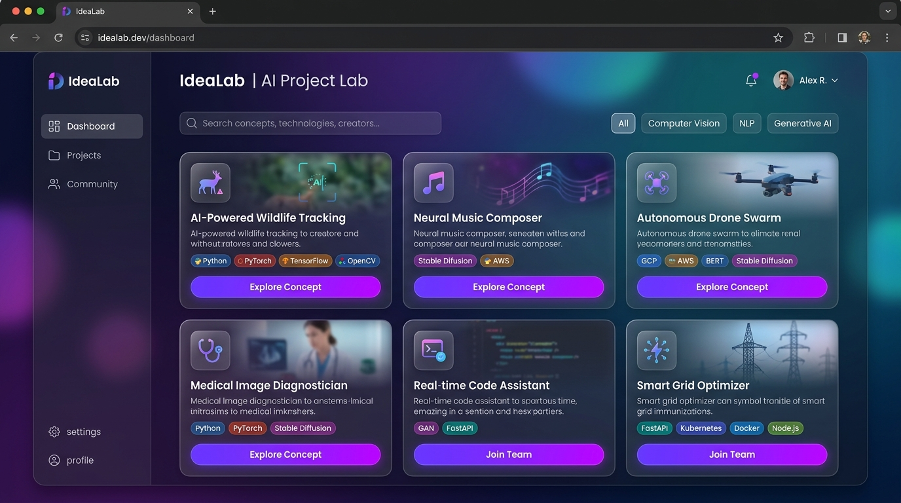
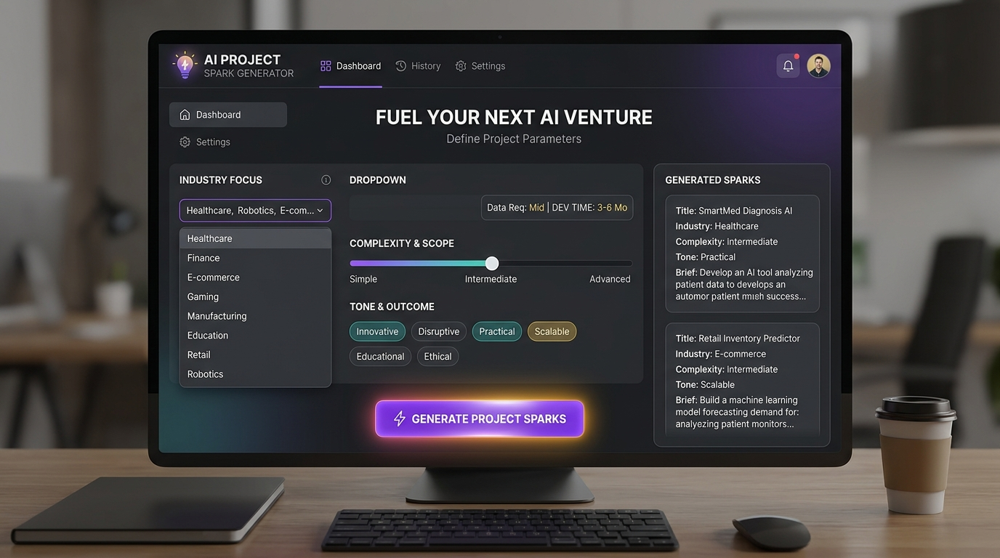
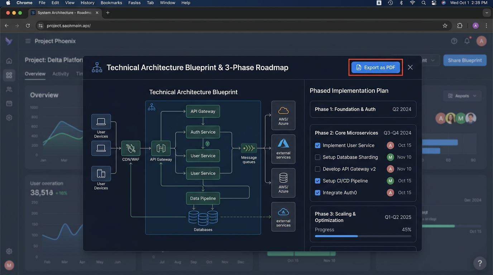

# 🚀 IdeaLab — AI Project Blueprint & Tech Spec Synthesis Engine

> **Live Deployed Application:** [https://ais-pre-je5u2nwalarkbfnl7p5iu7-606312097545.asia-southeast1.run.app](https://ais-pre-je5u2nwalarkbfnl7p5iu7-606312097545.asia-southeast1.run.app)

---

## 📌 Executive Summary & Problem Solved

### What is IdeaLab?
**IdeaLab** is a full-stack, AI-driven project ideation and technical blueprint synthesis portal engineered for software developers, startup founders, hackathon builders, and product managers. It transforms vague ideas or domain criteria into production-ready technical architecture specs, feature breakdowns, and actionable 3-phase implementation roadmaps.

### The Problem It Solves
Developers and creators frequently encounter **"blank canvas paralysis"** when beginning a new project. Translating a high-level vision into structured technical requirements takes hours of manual planning:
- Choosing cohesive frontend, backend, and database tech stacks.
- Structuring core features with concise technical descriptions.
- Sequencing development tasks into practical execution phases.
- Writing architectural AI developer prompts for code assistants.

**IdeaLab eliminates this friction.** In under 3 seconds, it generates an end-to-end technical blueprint tailored to specific industry domains, aesthetic design vibes, target complexity levels, and preferred technology stacks.

---

## 🌟 Comprehensive Features List

- **🔍 Curated Sparks Catalog & Instant Filter Engine**:
  - Browse pre-synthesized high-impact project blueprints across FinTech, HealthTech, AI/ML, EdTech, CyberSecurity, and Web3.
  - Real-time search across titles, tags, and tech stacks with industry and complexity category pills.

- **⚡ AI Blueprint Generator (Gemini 3.6 Flash Powered)**:
  - Custom parameters: Industry Domain, Aesthetic Vibe/Mood, Complexity Level (*Beginner*, *Intermediate*, *Expert*, *Moonshot*), and Technology Stack tags.
  - Live AI generation with smooth state transitions, generating structured JSON technical specs.

- **📐 Detailed Architecture Blueprints**:
  - **Executive Overview & Problem Context**: Concise summary of what the software does and why it provides high value.
  - **Tech Stack Specifications**: Frontend, backend, database, and AI service selections with tailored technical reasoning.
  - **4-Feature Breakdown**: In-depth description of key application modules.
  - **Interactive 3-Phase Roadmap**: Checkable task lists for Setup & Design, MVP Build, and Scale & Expansion.
  - **AI Developer Strategy**: Prompting guidance and architectural execution advice.

- **📄 Multi-Format Export Engine**:
  - **Physical PDF Document Download**: Built-in multi-page PDF generator using `jspdf`, formatted with custom headers, section styling, metadata boxes, and crisp typography.
  - **Markdown (.md)**: Production-ready documentation for `README.md` or GitHub repos.
  - **JSON Spec (.json)**: Clean structured data format for programmatic imports.
  - **Summary (.txt)** & **One-click Clipboard Copy**.

- **🔖 Personal Workspace & Build Manager**:
  - Bookmark and save blueprints to a persistent personal library.
  - Update project build statuses (*Not Started*, *In Progress*, *Built*, *Archived*).
  - Private developer scratchpad notes for each project.
  - LocalStorage persistence across user sessions.

- **🔐 User Authentication & Demo Profiles**:
  - Full Sign In and Account Creation modal.
  - Quick 1-click Demo Developer (*Alex Rivera*) and Demo Founder (*Samantha Chen*) profiles for rapid testing.
  - User session state stored locally with user avatar and role badges.

---

## 🖼️ Application Screenshots

### 1. Developer Dashboard & Sparks Catalog

*Figure 1: Main portal dashboard displaying curated technical sparks, search bar, and industry domain filters.*

### 2. AI Blueprint Generator Interface

*Figure 2: AI Spark Generator workspace with custom domain, vibe, complexity, and tech stack parameters.*

### 3. Architecture Blueprint & Multi-Format PDF Exporter

*Figure 3: Interactive blueprint modal showing the 3-phase implementation roadmap and PDF document export.*

---

## 🤖 The AI Feature & Prompt Architecture

### What the AI Feature Does
IdeaLab leverages the **Google Gemini 3.6 Flash** model (`gemini-3.6-flash`) via the official `@google/genai` TypeScript SDK. The server route (`/api/generate-idea`) accepts user parameters and enforces strict JSON Schema output matching the TypeScript application interfaces.

### System Prompt & JSON Schema Instruction (verbatim from `server.ts`)

```typescript
const prompt = `Generate a high-fidelity, highly creative software project concept idea for a developer or startup creator based on the following input parameters:
- Industry: ${industry}
- Aesthetic Vibe/Mood: ${vibe}
- Project Complexity: ${complexity}
- Tech Stack specified: ${Array.isArray(techStack) ? techStack.join(', ') : techStack}

Provide a comprehensive, inspiring, and technically sound blueprint including a catch project title, tagline, detailed description, feature breakdown (4 features), 3-phase implementation roadmap, and strategic advice.`;
```

#### Enforced JSON Response Schema:
```json
{
  "type": "OBJECT",
  "properties": {
    "title": { "type": "STRING", "description": "Catchy 1-2 word project name" },
    "tagline": { "type": "STRING", "description": "Single sentence descriptive subtitle" },
    "description": { "type": "STRING", "description": "2-3 sentence overview" },
    "tags": { "type": "ARRAY", "items": { "type": "STRING" } },
    "visualizationPrompt": { "type": "STRING" },
    "techStack": {
      "type": "ARRAY",
      "items": {
        "type": "OBJECT",
        "properties": {
          "name": { "type": "STRING" },
          "category": { "type": "STRING" }
        },
        "required": ["name", "category"]
      }
    },
    "featureBreakdown": {
      "type": "ARRAY",
      "items": {
        "type": "OBJECT",
        "properties": {
          "title": { "type": "STRING" },
          "description": { "type": "STRING" }
        },
        "required": ["title", "description"]
      }
    },
    "implementationRoadmap": {
      "type": "OBJECT",
      "properties": {
        "phase1": { "type": "OBJECT", "properties": { "title": { "type": "STRING" }, "tasks": { "type": "ARRAY" } } },
        "phase2": { "type": "OBJECT", "properties": { "title": { "type": "STRING" }, "tasks": { "type": "ARRAY" } } },
        "phase3": { "type": "OBJECT", "properties": { "title": { "type": "STRING" }, "tasks": { "type": "ARRAY" } } }
      },
      "required": ["phase1", "phase2", "phase3"]
    },
    "generatedStrategy": { "type": "STRING" }
  }
}
```

---

## 🛠️ Tools, Services, & AI Models Used

| Tool / Technology | Role in Architecture |
| :--- | :--- |
| **Google Gemini 3.6 Flash** (`gemini-3.6-flash`) | Core AI engine for structured blueprint synthesis |
| **Google AI Studio** | Application hosting environment & platform SDK orchestration |
| **React 19 & TypeScript** | Client-side reactive UI component tree |
| **Tailwind CSS v4** | Utility-first styling & custom glassmorphism design system |
| **Node.js & Express** | Secure full-stack server proxy for Gemini API calls |
| **jsPDF** | Client-side physical document generator for multi-page PDFs |
| **Vite** | Lightning-fast development & production asset bundler |
| **Google Material Symbols & Lucide** | Modern iconography set |

---

## 💻 How to Run the Project Locally

### Prerequisites
- Node.js (v18.0.0 or higher)
- npm or yarn

### Step 1: Clone the Repository
```bash
git clone <repository-url>
cd idealab-app
```

### Step 2: Install Dependencies
```bash
npm install
```

### Step 3: Configure Environment Variables
Create a `.env` file in the root directory (or copy from `.env.example`):
```env
GEMINI_API_KEY=your_google_gemini_api_key_here
```

### Step 4: Start Development Server
```bash
npm run dev
```
Open your browser and navigate to `http://localhost:3000`.

### Step 5: Build for Production
```bash
# Build the Vite frontend and bundle Express server
npm run build

# Launch production server
npm start
```

---

## 🌐 Live Deployment
The application is deployed live and fully functional at:
👉 **[https://ais-pre-je5u2nwalarkbfnl7p5iu7-606312097545.asia-southeast1.run.app](https://ais-pre-je5u2nwalarkbfnl7p5iu7-606312097545.asia-southeast1.run.app)**

---
*Created with Google AI Studio & Gemini Models.*
